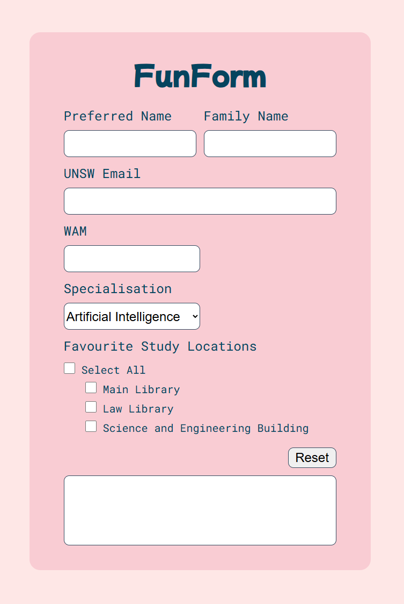

# Changelog

Our team will update this section when changes are made to the assignment specification.

## v0.0.1 — 03/03/2026

- Renamed page title and heading from "FunForm" to "Form Fiddle" in `task1/src/index.html`
- Renamed CSS class `.favHobbiesContainer` to `.favStudyLocationsContainer` in both `task1/src/index.html` and `task1/src/index.css`

# Assessment 2 (Vanilla JS)

[Please see course website for full spec](https://cgi.cse.unsw.edu.au/~cs6080/NOW/assessments/assignments/ass2)

This assignment is due **_Monday the 9th of March 2026, 8pm_**.

Please run `./util/setup.sh` in your terminal before you begin. This will set up some checks in relation to the "Git Commit Requirements".

## Your Task - FormFiddle

### 1. Overview

The HTML page in `task1/src/index.html` displays a series of inputs, and when valid, outputs a "summary" of this information in the textarea at the bottom of the page.

You are going to make this form dynamic and interactive through use of Javascript only **(Modification or addition of any HTML or CSS is prohibited)**.

#### 1.1. The Page

The page consists of a:

- Form
  - Text input for `Preferred Name` and `Family Name`, valid input:
    - each must be between 3 and 50 alphabetical characters inclusive. For e.g. `bob`
  - Text input for `UNSW Email`, valid input must either:
    - start with a lowercase "z" directly followed by 7 numbers and "@unsw.edu.au". This means it must match the regex expression "^z[0-9]{7}@unsw\\.edu\\.au$". For e.g. `z1234567@unsw.edu.au`.
    - or, start with the value of `Preferred Name` and `Family Name` connected by a full stop, and directly followed by "@unsw.edu.au". For e.g. `preferred.family@unsw.edu.au`.
  - Text input for `WAM`, valid input:
    - must be a number between `0.00` and `100.00` inclusive, with up to two decimal places. For e.g. `85.50`
  - Dropdown for `Specialisation` (Artificial Intelligence (default), Computer Networks, Database Systems, Embedded Systems, Security Engineering).
  - Checkbox group for `Favourite Study Locations` (Main Library, Law Library, and Science and Engineering Building).
  - Checkbox to `Select All`.
- `Reset` button
- Textarea (initially blank)

#### 1.2. Actions

The following are events that trigger a render that should be binded to particular actions

- Blur of the `Preferred Name`, `Family Name`, `UNSW Email`, or `WAM` should trigger a render.
- Changing of the `Specialisation` or `Favourite Study Locations` should trigger a render.

There are key buttons on the page:

- When the `Select All` checkbox is checked, all three `Favourite Study Locations` checkboxes are selected.
  - At any time when all 3 `Favourite Study Locations` are selected, the `Select All` checkbox is checked.
  - At any time when one of the `Favourite Study Locations` checkboxes are deselected, the `Select All` checkbox is unchecked.
- When `selectAll` goes from checked to unchecked, all three `Favourite Study Locations` checkboxes are unchecked.
- When the `Reset` button is clicked, the `textarea` has all of its text removed (i.e. it becomes blank again), and all of the form elements are reset to their default state.

#### 1.3. Rendering

The "output" refers to what the inner text should be of the textarea at the bottom of the page.

- If they haven't inputted a `Preferred Name`, or the `Preferred Name` entered is invalid, the output should be _"Please input a valid preferred name"_
- If they have inputted a `Preferred Name`, but haven't inputted a `Family Name` / the `Family Name` is invalid, the output should be _"Please input a valid family name"_
- If they have inputted a `Preferred Name` and `Family Name`, but haven't inputted a `UNSW Email` / the `UNSW Email` is invalid, the output should be _"Please input a valid UNSW email"_
- If they have inputted a `Preferred Name`, `Family Name` and `UNSW Email`, but haven't inputted a `WAM` / the `WAM` is invalid, the output should be _"Please input a valid WAM"_
- If they have entered the above correctly, the output is _"My name is [Preferred Name] [Family Name] [zID], my academic standing is [standing]. I specialise in [Specialisation], and [Favourite Study Locations]."_
  - If the `UNSW Email` begins with a lowercase "z" directly followed by 7 numbers and "@unsw.edu.au"
    - [zID] are the characters in the `UNSW Email` before "@unsw.edu.au".
    - [zID] is surrounded by an opening and closing bracket. For e.g. `(z1234567)`
    - `Family Name` and "(zID)" should be separated by a space. For e.g. If `UNSW Email` is `z1234567@unsw.edu.au` then it would be `My name is Hayden Smith (z1234567),`.
  - If the `UNSW Email` begins with the value of `Preferred Name` and `Family Name` connected by a full stop, and directly followed by "@unsw.edu.au".
    - [zID] is empty.
    - There should be no space after `Family Name`. For e.g. `My name is Hayden Smith,`.
  - [standing] is determined from the `WAM` value:
    - `00.00` ≤ WAM < `50.00` → _"Fail"_
    - `50.00` ≤ WAM < `65.00` → _"Pass"_
    - `65.00` ≤ WAM < `75.00` → _"Credit"_
    - `75.00` ≤ WAM < `85.00` → _"Distinction"_
    - `85.00` ≤ WAM ≤ `100.00` → _"High Distinction"_
  - `Favourite Study Locations` output formatting:
    - If no locations are selected, [Favourite Study Locations] is _"I have no favourite study location"_
    - If 1 location is selected, [Favourite Study Locations] is _"my favourite study location is [location 1]"_
    - If 2 locations are selected, [Favourite Study Locations] is _"my favourite study locations are [location 1], and [location 2]"_
    - If all locations are selected, [Favourite Study Locations] is _"my favourite study locations are [location 1], [location 2], and [location 3]"_.

### 2. Getting started

This task requires you to modify `src/script.js` and **only** this file. Everything is done in this file. **Do NOT modify the HTML or CSS file**.

### 3. Sample outputs

The following are sample outputs for different valid combinations of value entries into the form.

1. My name is Edison Thomas (z5301234), my academic standing is Distinction. I specialise in Artificial Intelligence, and my favourite study location is Main Library.

2. My name is Kate spade (z5501310), my academic standing is Credit. I specialise in Computer Networks, and my favourite study locations are Law Library, and Science and Engineering Building.

3. My name is hayden Smith (z0000001), my academic standing is High Distinction. I specialise in Database Systems, and I have no favourite study location.

4. My name is eckles web, my academic standing is Fail. I specialise in Embedded Systems, and my favourite study locations are Main Library, and Science and Engineering Building.

5. My name is Kiki Koriko, my academic standing is Pass. I specialise in Security Engineering, and my favourite study locations are Main Library, Law Library, and Science and Engineering Building.

Ensure that your output in the textarea matches the **spacing, letter casing and wording** for each of the examples provided. Also note that favourite study locations are listed in order of their checkbox.

Please note: favourite study locations are listed in order of how we describe them, NOT in the order they are clicked. Regardless of the order they were clicked the output will follow the same pattern.

You need to write Javascript (typically a combination of event listeners and DOM manipulations) that listen for actions described in `1.2` and render the page described in `1.3` in conjunction with any constraints described in `1.1`.
